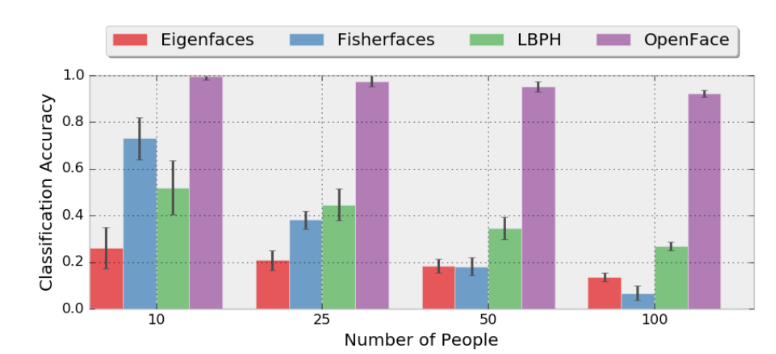
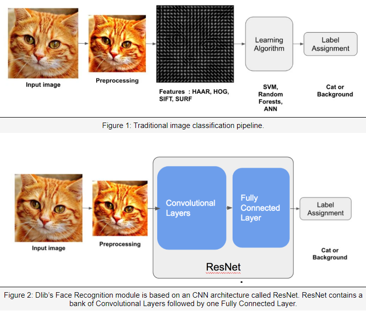
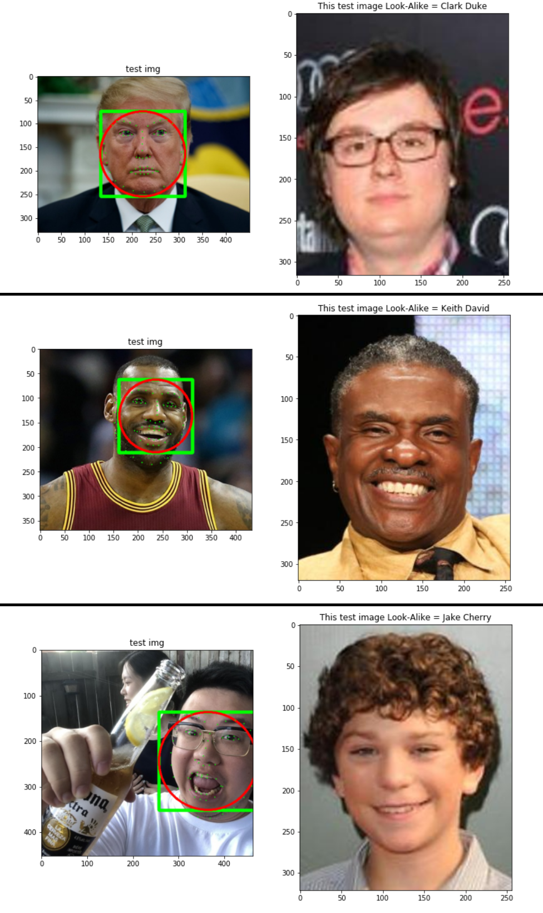

# Face Recognition & Applications

This repo are implementing facial recognition and its applications.  
Facial Recognition can be achieved by a variety of techniques using DNN module.  
This repos will discuss this topic from three perspectives:
- Opencv Face Recognition API
- OpenFace (provided in the Opencv DNN module)
- DNN Face Recognition (provided in the Dlib)

## Opencv Face Recognition API
OpenCV provides three different methods for performing Face Recognition through the `FaceRecognizer` class which provides functions for training and prediction:
1. Eigen Faces
2. Fisher Faces
3. Local Binary Patterns Histograms

## OpenFace
It is based on the CVPR paper "FaceNet : A Unified Embedding for Face Recognition and Clustering". The model is trained on 500K images using the datasets FaceScrub and CASIA-WebFace. It has a accuracy of 92.9% on the LFW benchmark.  
Compared the accuracy with these traditional methods, as the number of people increase in the training sets, the traditional methods start to fail.

## DNN Face Recognition
Face Recognition model using Dlib. The Dlib model is more accurate than OpenFace. It has an accuracy of 99.38% on the LFW banchmark. 
In a traditional image classification pipeline, it converted the image into a feature vector in a higher dimensional space. This was done by calculating the feature descriptor (e.g. HOG) for an image patch. Once the image was represented as a point in a higher dimensional space, a learning algorithm like SVM to partition the space using hyperplanes could separate points representing different classes. 
Even though on the surface Deep Learning looks very different from the above model, there are conceptual similarities.

The bank of conv layers produce a feature vector in higher dimensional space just like the HOG descriptor. So what’s the difference between a bank of conv layers and HOG descriptor? The most important differences are:
1. HOG is a fixed descriptor. There is an exact recipe for calculating the descriptor. On the other hand, a bank of conv layers contains many convolution filters. These filters are learned from the data. So unlike HOG, they adapt based on the problem at hand. 
2. The FC layer does the same job as the SVM classifier in traditional approaches. It classifies the feature vector. In fact, sometimes the final FC layer is replaced by an SVM. 

## CapStone Project: DoppelGanger
In this project, I will use the Face Embeddings to find a doppelganger or look-alike to a given person. Specifically, there will be images of two persons and a celebrity dataset. The task will be to find their celebrity look-alike. 
1. Load the model for face landmarks and face recognition;
2. Enrollment of Celeb Images;
3. Testing: using minimum distance rule and compare it with the enrolled celebs to find the look-alike.

